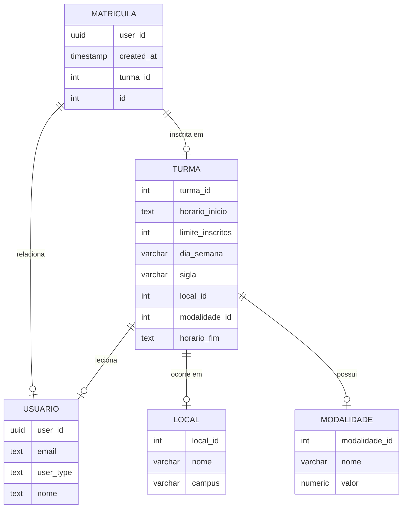

# 🏀 Núcleo de Esportes

## 👥 Colaboradores

## [Alexsandro Patricio](https://github.com/alexpatri) | [Dante Borges](https://github.com/DanteBLima) | [Luiz Felipe Guerra](https://github.com/LFguerra1) | [Marcos Paulo França](https://github.com/marcospaulofjl)

## 📌 Introdução

### Descrição Geral

Este projeto será uma sessão do site do [CEUB](https://www.uniceub.br/nucleo-de-esportes), onde os alunos, professores e o público externo possam se increver em aulas de esportes. O sistema facilitará a escolha de turmas com base na disponibilidade de vagas, campus, horários e dias da semana.

👉 Acesse diretamente pelo link: [nucleo-de-esportes](https://core.ajlabs.net/aluno)

### Objetivo

Criar uma plataforma intuitiva para gerenciamento de inscrições em aulas de esportes, otimizando a alocação de vagas e facilitando o acesso às informações das turmas.

## 📌 Requisitos do Projeto

### Requisitos Funcionais

- O usuário deve poder filtrar turmas por campus, horário e dias da semana.
- O usuário deve poder visualizar todas as turmas disponíveis.
- O sistema deve mostrar a disponibilidade de vagas em tempo real.
- O usuário deve poder se inscrever em uma turma caso haja vaga disponível.
- O usuário deve poder cancelar sua inscrição.
- Administradores devem poder criar, editar e excluir turmas.

### Requisitos Não Funcionais

- O sistema deve ser acessível via navegador web em dispositivos móveis e desktop.
- O sistema deve ter um bom tempo de resposta
- O sistema deve ter autenticação para evitar múltiplas inscrições indevidas.
- O design deve ser responsivo e acessível.

### Requisitos de Software

- **Front-end:** React
- **Back-end:** GoLang
- **Banco de Dados:** Supabase

## 🏗️ Modelos

### 💻 Front-end

https://www.figma.com/design/p8onVM9ZwQ5CcGEFjUyJix/N%C3%BAcleo-de-Esportes?node-id=0-1&t=ZRHJARTQ0HBRx5Tr-1

### ⚙️ Back-end

[Documentação da API](https://nucleo-de-esportes.github.io/backend/swagger/index.html)

### 🗂️ Banco de Dados

